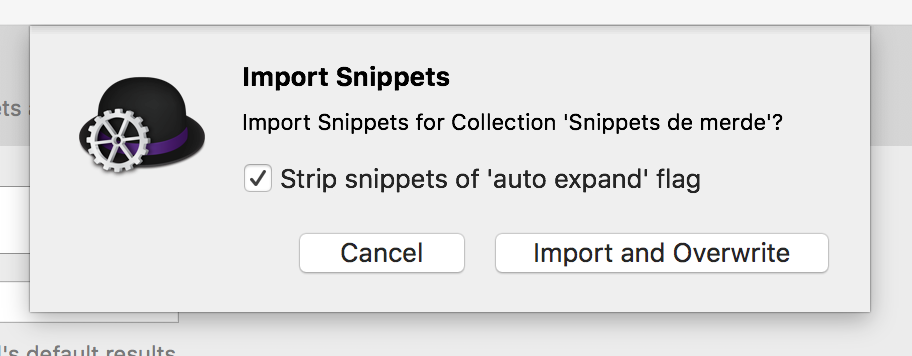
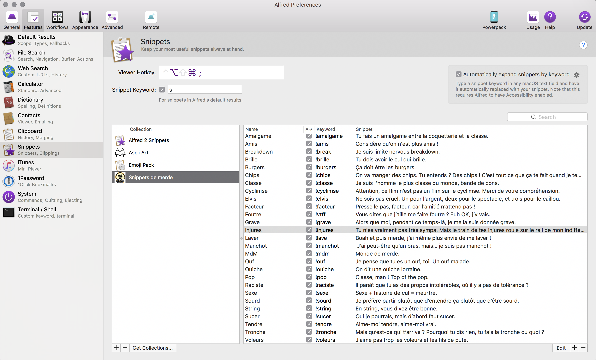
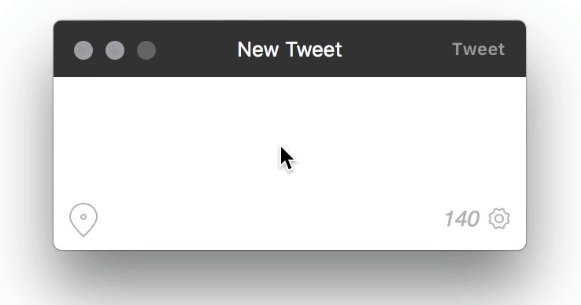
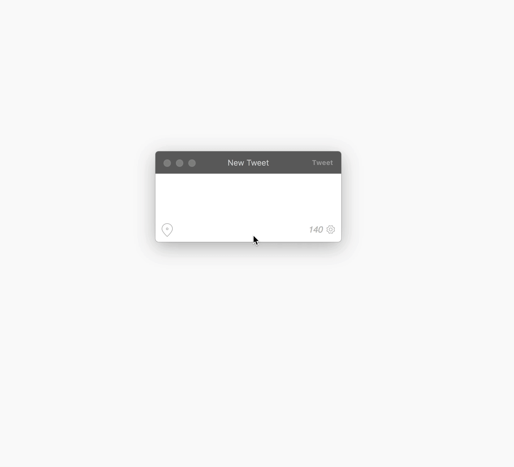

# Snippets de merde (which means Shitty snippets)

An Alfred app snippets collection of quotes for fans of the famous &amp; forbidden underground movie "La Classe américaine"

##Install

###Step 1 : Install Alfred
If you don't have **Alfred app** installed already with a [Powerpack license] and don't intend to buy one, or if your computer just doesn't run on OS X, you can stop right here. 😁

If you do have **Alfred app** installed on your system or intend to do so and you still don't have a [Powerpack License]… well, WTF are you waiting for? It's really cheap compared to the boost of productivity it provides. Seriously, i'm not even paid to say that, it's just the way i feel about it. Plus, you can't say Alfred is magnificent or shitty until you tried the Powerpack… It's just like you didn't even tested the app yet, just sayin.

###Step 2 : Download the Snippets collection
[Just download it directly here](https://github.com/GoOz/snippetsdemerde/blob/master/Snippets%20de%20merde.alfredsnippets?raw=true)

###Step 3 : Install the collection
Once you downloaded the package, just double click it, it'll be opened with Alfred (if the app is already running, if not… why the fuck not?).

You should see an alert like this ⬇

You can check or uncheck, it's you choice, it just depends on what behavior you prefer.
Basically, if you let the box checked it won't auto expand the snippet, you'll have to interact with Alfred to insert the content of the snippet.
If you uncheck, just write the keyword and it will automatically expand to the content of the snippet

But we'll see later how it works. You can change it anytime you want after the import anyway by clicking on the boxes next to every snippet in the collection, so just click on the damn Import button now.

###Step 4 (optional) : Edit the preferences
If you want the snippets to auto expand, which means you uncheck the box just before, you'll need to give Alfred some accessibility privileges.

To do so, you need to be on the panel of snippets preferences (where you should already be just after you import the collection in theory).
This is this panel ⬇

You can notice a box in the top right corner regarding auto expanding.
Just check the damn box and go add accessibility privileges to Alfred, you selfish bastard.

📌 If you want some applications to **NOT** use auto expanding, you can do so by clicking on the gear of the same box and add those applications to the list.

## Usage

Let's say you wanted auto expanding (so you followed instructions in step 4), just go to any (allowed) application with a text input and try any keyword…
(in this case i'm testing the keyword `!pop` in Tweetbot, if you really wanna know)

And voilà!

Now let's say you don't want auto expand and you want to expand whenever the fuck you want and not every-fucking-time, which is also a valid point, i'm not judging.

You can then use Alfred like any other workflow and write `snip` which is the default keyword (mine is `s` but whatever) to launch the snippets feature and use fuzzy search to find the one you want and when you got it, tap `enter`

And voilà!

📌 You also can use a hotkey to launch the snippets feature, you don't have to use the `snip` keyword. Do whatever the fuck you want, i'm not your mother.

[Powerpack license]: https://www.alfredapp.com/powerpack/

